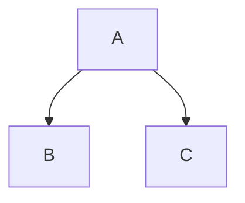

# Learning Git and Github!

## Sub-Headline

Version control is an essential skill for developers to master, and **Git** is by far the most popular version control system on the web. In this `fast-paced` course, you will learn how to install Git and use the fundamental commands you need to work with Git projects: moving files, managing logs, and working with branches.

Plus, you'll [learn]() how to work with the popular **GitHub** website to explore existing projects, clone them to your local hard drive, and use them as templates for your new projects.

### More Markdown Practice - ⏬

>[!NOTE]
>A note

>[!IMPORTANT]
>important

>[!WARNING]
>warning

- [x] First
  - [x] One
  - [ ] Two
- [x] Second

This is a footnote[^1]. Another footnote[^2].

[^1]: My reference
[^2]: Another reference

| Left | Center | Right |
| ---- | :----: | ----: |
| One | Two | Three |
| Four | Five | Six | 
| Seven | Eight | Nine | 



```js
let x = 5;
console.log(x);
```

***

1. Item One
2. Item Two
3. Item Three

* Item One
* Item Two
  - Indented
  - Another One

<details>
<summary>Collapsed</summary>

# Header

This is am example of collapsed text in markdown. 
</details>
